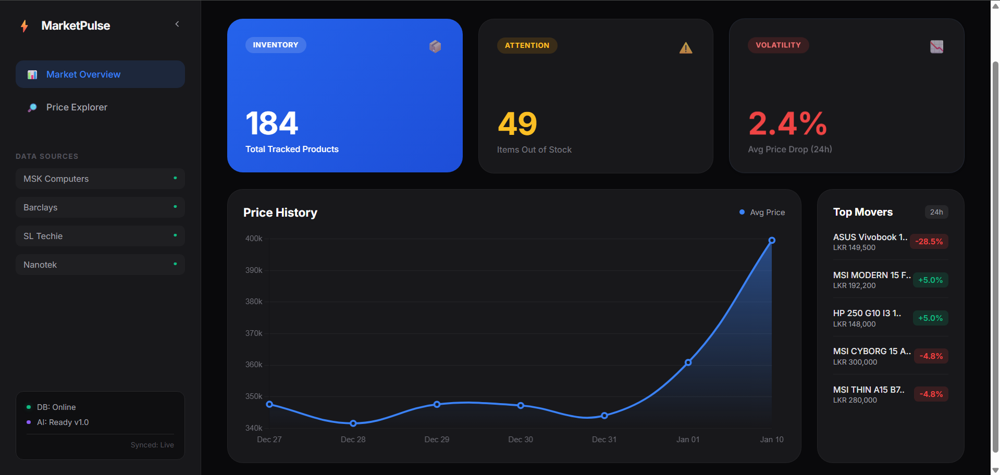
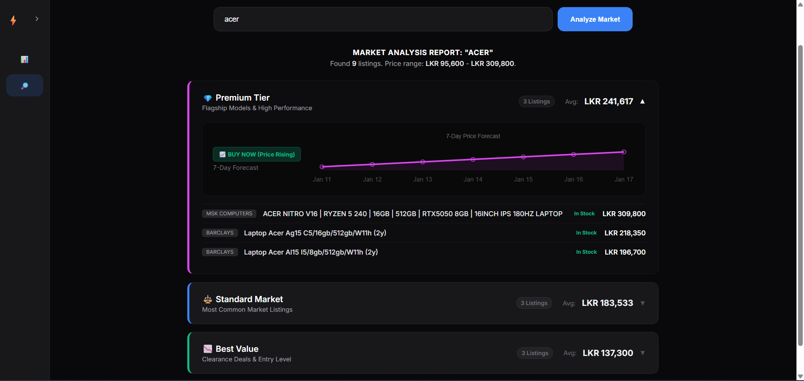

````markdown
# ⚡ MarketPulse AI - Intelligent Price Tracker

**MarketPulse** is a full-stack data intelligence platform designed to track, analyze, and predict laptop prices across multiple e-commerce vendors in Sri Lanka. It combines automated web scraping with machine learning to provide actionable market insights.


_General overview of the market_


_Default view of Price Explorer_


_Search view with tiered pricing analysis_

---

## 🚀 Key Features

- **📊 Market Intelligence Dashboard:** Real-time visualization of market trends, inventory levels, and top-moving products.
- **🔍 AI-Powered Price Explorer:** Search for specific laptop models and view a **7-day price forecast** generated by our predictive engine.
- **🧠 Smart Segmentation:** Automatically categorizes laptops into **Premium**, **Standard**, and **Value** tiers based on specs and market positioning.
- **🤖 Automated ETL Pipeline:** Includes a custom-built automation system that scrapes fresh data daily without manual intervention.
- **📉 Volatility Tracking:** Identifies price drops and stock shortages instantly.

---

## 🛠️ Tech Stack

- **Backend:** Python 3.12, Flask
- **Database:** SQLite (Lightweight & Portable)
- **Data Processing:** Pandas, NumPy
- **Machine Learning:** Scikit-Learn (Linear Regression for Time-Series Forecasting)
- **Web Scraping:** Selenium WebDriver
- **Frontend:** HTML5, CSS3, Chart.js
- **Automation:** Windows Task Scheduler & Batch Scripting

---

## ⚙️ Installation & Setup

Follow these steps to run the project locally.

### 1. Clone the Repository

```bash
git clone [https://github.com/HimethWe/MarketPulse.git](https://github.com/HimethWe/MarketPulse.git)
cd MarketPulse
```
````

### 2. Set Up Virtual Environment

It is recommended to use a virtual environment to manage dependencies.

```bash
python -m venv venv
.\venv\Scripts\activate

```

### 3. Install Dependencies

```bash
pip install -r requirements.txt

```

### 4. Run the Application

Start the Flask server:

```bash
python src/flask_app/app.py

```

Open your browser and navigate to: `http://127.0.0.1:5000`

---

## 🔄 Automated Data Pipeline (Local Setup)

To keep the dashboard data fresh, this project includes a local automation script. You do not need to run the scraper manually every time.

### How to Schedule Daily Updates (Windows)

1. Locate the `run_scraper.bat` file in the project root folder.
2. Open **Windows Task Scheduler** and click **"Create Basic Task"**.
3. **Name:** "MarketPulse Auto-Scraper".
4. **Trigger:** Select **Daily** and choose a time (e.g., 08:00 AM).
5. **Action:** Select **Start a Program**.
6. **Program/script:** Browse and select the `run_scraper.bat` file.
7. **Start in (optional):** **CRITICAL STEP** - Paste the full path to this project folder (e.g., `C:\Projects\MarketPulse`). **Do not use quotes.**
8. Finish the setup.

The system will now wake up automatically, fetch the latest prices from 4+ vendors, update the database, and retrain the AI models every day.

```

```
